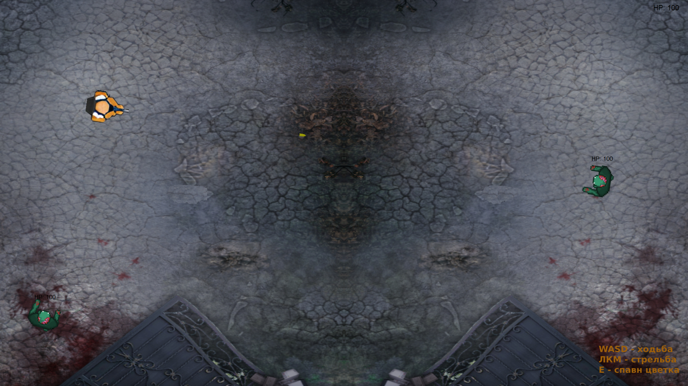

# SanyaVsZondB

SanyaVsZondB — это Roguelike Topdown shooter, в котором ваша цель отбиться от толпы злых зондбэ, которые хотят навредить садоводу Сане.

В мире, где технологии и магия переплетены в единую ткань, существует уникальная история о садоводе по имени Саня. 
В этом мире большинство населения было превращено в зондбэ — аналог зомби, подчиненные некой таинственной энергии. 
Саня остался в этом мире один, и его задача — бороться с этим злом, используя свои знания о растениях и их свойствах.

## Особенности

- **Цветы:** Саня умеет сажать цветы, которые не только выживают в любых условиях, но еще и способны помочь в борьбе против зондбэ!
-**Усиления:** После каждого уровня игроку предлагается на выбор одно из трех усилений для Сани или его цветка, и одно из трех для зондбэ.

>_Усиления включают в себя смену оружия, усиление характеристик героя, цветов и зондбэ_

## Уровни

Всего 5 уровней, на следующем уровне игрока ждет больше зондбэ. На каждом уровне они разные!

>_Зондбэ могут быть более крепкими, сильными, медлительными или в большом количестве(независимо от выбранных улучшений)_

## Управление

- **Передвижение:** W, A, S, D
- **Стрельба:** Левая кнопка мыши
- **Посадка цветов:** E

>_Управление указано во время игры в правом нижнем углу_

## Как начать играть
   - [Скачайте игру](https://drive.google.com/drive/folders/1_n-99lUDDgi3Uo6MSwFxeWH47Mr1PCGT?usp=sharing)
   - Запустите SanyaVsZondB.exe

Погрузитесь в мир и становитесь последним садовником, Саней, в вашем стремлении выжить как можно дольше среди полчищ зондбэ. 
Используйте свои знания о растениях и умения превратить их в оружие, чтобы очистить мир от зондбэ!
